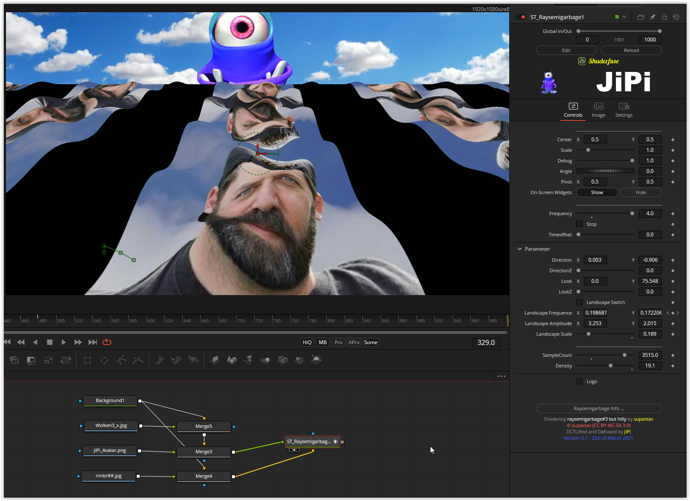

<!-- +++ DO NOT REMOVE THIS COMMENT +++ DO NOT ADD OR EDIT ANY TEXT BEFORE THIS LINE +++ IT WOULD BE A REALLY BAD IDEA +++ -->

A very small shader, but I found it very good for getting to know the basic principles.
We have a raymarching function that can be set with the two parameters SampleCount & density. We have the two three-dimensional parameters Direction & Look (Camera) to set the view of the scene. The standard block scale, offset, angle and pivot relate to the scanning and are completely independent of raymarching.
The shader shows a texture (Image1) on a surface that can be distorted in the X and Y directions (sinus/cosinus). A second texture can be loaded for the horizon (sky) (Image2).
Due to the many parameters, you can now understand the mode of action very well. No garbage, just a cute little shader :-)

Have fun playing

<!-- +++ DO NOT REMOVE THIS COMMENT +++ DO NOT EDIT ANY TEXT THAT COMES AFTER THIS LINE +++ TRUST ME: JUST DON'T DO IT +++ -->

