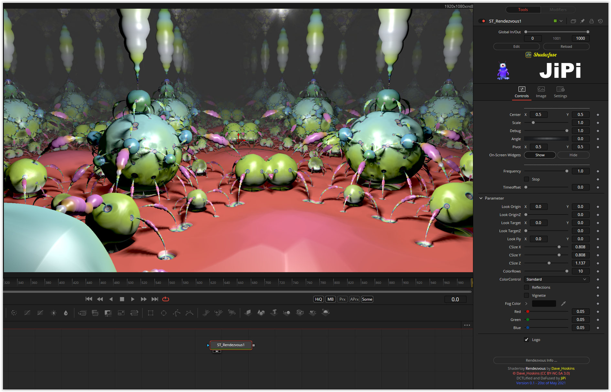

# Rendezvous

This Fuse is based on the Shadertoy '_[Rendezvous](https://www.shadertoy.com/view/ldjGDw)_' by [Dave_Hoskins](https://www.shadertoy.com/user/Dave_Hoskins). Conversion to DCTL and encapsulation into a fuse done by [JiPi](../../Site/Profiles/JiPi.md). See [Fractals](README.md) for more fuses in this category.

[](https://www.shadertoy.com/view/ldjGDw "View on Shadertoy.com")


<!-- +++ DO NOT REMOVE THIS COMMENT +++ DO NOT ADD OR EDIT ANY TEXT BEFORE THIS LINE +++ IT WOULD BE A REALLY BAD IDEA +++ -->

A flight through a colorful fractal landscape that breathes and seems to be alive. An impressively compact code for the definition of the landscape and you don't necessarily need matrices to program a great camera flight, as you can see.


Have fun

```
float Map( vec3 p )
{
	float scale = 1.0;
	float add = sin(iTime)*.2+.1;

	for( int i=0; i < 9;i++ )
	{
		p = 2.0*clamp(p, -CSize, CSize) - p;
		float r2 = dot(p,p);
		float k = max((1.15)/r2, 1.);
		p     *= k;
		scale *= k;
	}
	float l = length(p.xy);
	float rxy = l - 4.0;
	float n = l * p.z;
	rxy = max(rxy, -(n) / (length(p))-.07+sin(iTime*2.0+p.x+p.y+23.5*p.z)*.02);
    float x = (1.+sin(iTime*2.));x =x*x*x*x*.5;
    float h = dot(sin(p*.013),(cos(p.zxy*.191)))*x;
	return ((rxy+h) / abs(scale));

}
```
[](Rendezvous.fuse)

<!-- +++ DO NOT REMOVE THIS COMMENT +++ DO NOT EDIT ANY TEXT THAT COMES AFTER THIS LINE +++ TRUST ME: JUST DON'T DO IT +++ -->

## Compatibility

🟩 macOS / Metal: <span style="color:green; ">checked</span><br />
🟥 macOS / OpenCL<br />
🟩 Windows / CUDA: <span style="color:green; ">checked</span><br />
🟩 Windows / OpenCL: <span style="color:green; ">checked</span><br />


## Problems

Number of problems: 1

- macOS_OpenCL compatibility: 💣💣💣


