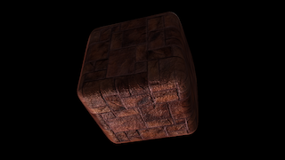
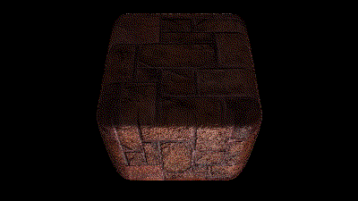

# LonelyVoxel

This Fuse is based on the Shadertoy '_[LonelyVoxel](https://www.shadertoy.com/view/Mslczn)_' by [SudoNhim](https://www.shadertoy.com/user/SudoNhim). Conversion to DCTL and encapsulation into a fuse done by [JiPi](../../Site/Profiles/JiPi.md). See [Object](README.md) for more fuses in this category.

<!-- +++ DO NOT REMOVE THIS COMMENT +++ DO NOT ADD OR EDIT ANY TEXT BEFORE THIS LINE +++ IT WOULD BE A REALLY BAD IDEA +++ -->

A cube with rounded corners and a very nice bump map.

He is still lonely the voxel. But underlaid with some music in a little intro and you have a sociable composition. A possible extension would be to provide the six sides with different textures. The animation of the texture relative to the movement of the cube is particularly effective.

Have fun playing

One way of including a gif anim ...

... and the other way ...

... we'll have to see what's the advantage of one variant over the other?!?

<!-- +++ DO NOT REMOVE THIS COMMENT +++ DO NOT EDIT ANY TEXT THAT COMES AFTER THIS LINE +++ TRUST ME: JUST DON'T DO IT +++ -->

