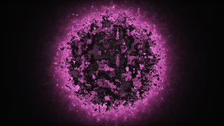

# MightyMorphingPowerSphere

This Fuse is based on the Shadertoy '_[MightyMorphingPowerSphere](https://www.shadertoy.com/view/MtGSzh)_' by [Lallis](https://www.shadertoy.com/user/Lallis). Conversion to DCTL and encapsulation into a fuse done by [JiPi](../../Site/Profiles/JiPi.md). See [Planet](README.md) for more fuses in this category.

<!-- +++ DO NOT REMOVE THIS COMMENT +++ DO NOT ADD OR EDIT ANY TEXT BEFORE THIS LINE +++ IT WOULD BE A REALLY BAD IDEA +++ -->

The suggestion for this shader came from the WSL forum. After a first look, the conversion seemed to be done quickly and the first fragment shader version was done quickly. However, the appearance did not exactly match the original. The use of a noise color texture always results in changes, since the original image is not available and the dimensions and resolutions vary. But it was noticeable when the fuse was being built. This difference is so serious that it could no longer be explained with the noise color texture. So we went looking. Finally, there was an interesting line of code:

```
col = mix (vec3 (0.05), keepo, clamp (0.0,1.0, smoothstep (1.0,0.0,2.0-length (rp))));
```
Here it was not mixed between a dark color and "keepo" using smoothstep, as intended, but the "keepo" was constantly faded in.
The explanation for this was ultimately that WebGL and how we then tested OpenCL and metal optimized the clamp used. Cuda, on the other hand, did not do this and so the value was clamped to zero. The clamp function expects the value to be limited as the first parameter, here however zero. Due to the smooth step function, which in turn limits the value, the faulty clamp was eliminated. But the smoothstep is not used correctly either, because in this case the result is actually not defined. Here, however, all the systems behave in a compliant manner, so that the original appearance is achieved.
With this fuse it is possible to try both variants. These can be adjusted by parameterizing the thresholds. The scaling of the texture can be changed in all parameters. If no noise color texture is connected, a color can be specified. The background can be switched to be transparent. And the two prepared features in the shader (inversion and phong) can be activated.

Have fun playing


[](MightyMorphingPowerSphere.fuse)

<!-- +++ DO NOT REMOVE THIS COMMENT +++ DO NOT EDIT ANY TEXT THAT COMES AFTER THIS LINE +++ TRUST ME: JUST DON'T DO IT +++ -->

## Compatibility

🟩 macOS / Metal: <span style="color:green; ">checked</span><br />
⬛ macOS / OpenCL: <span style="color:red; ">NOT TESTED!</span><br />
🟩 Windows / CUDA: <span style="color:green; ">checked</span><br />
🟩 Windows / OpenCL: <span style="color:green; ">checked</span><br />


## Problems

Number of problems: 2

- Thumbnail seems to be not a 320x180 pixel PNG
- macOS_OpenCL compatibility not checked


