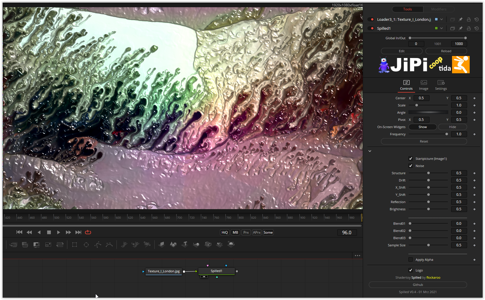

<!-- +++ DO NOT REMOVE THIS COMMENT +++ DO NOT ADD OR EDIT ANY TEXT BEFORE THIS LINE +++ IT WOULD BE A REALLY BAD IDEA +++ -->

A nice example for "computational flockarooid dynamics"

It took a while until the penny for the implementation of a BufferA in DCTL fell. I struggled with an offset and strong artifacts. When tida wrote a post with exactly this shader in WSL, I first created the recursive call using Pieter's "loop" (WeSuckLessForum). The construction of the multi-core fuse was successful and tida added great features and parameters.
Now I found the time for a clean-up.
The use of this type of fuses is not very easy to handle, since a cycle must not be interrupted or disturbed by changing parameters. There is a reset button for "practicing", this executes a purge cache and initializes the image memory with Image1. Image1 can also be loaded as an initialization image by ticking the "Startpicture" checkbox for the start frames. For the blend functionality, first set the blend control to 1, then to zero, then the flow process can be carried out. Keyframes or expressions are then necessary for the production.

Here is a little study with this fuse: https://www.youtube.com/watch?v=oyndG0pLEQQ

Have fun playing

<!-- +++ DO NOT REMOVE THIS COMMENT +++ DO NOT EDIT ANY TEXT THAT COMES AFTER THIS LINE +++ TRUST ME: JUST DON'T DO IT +++ -->

