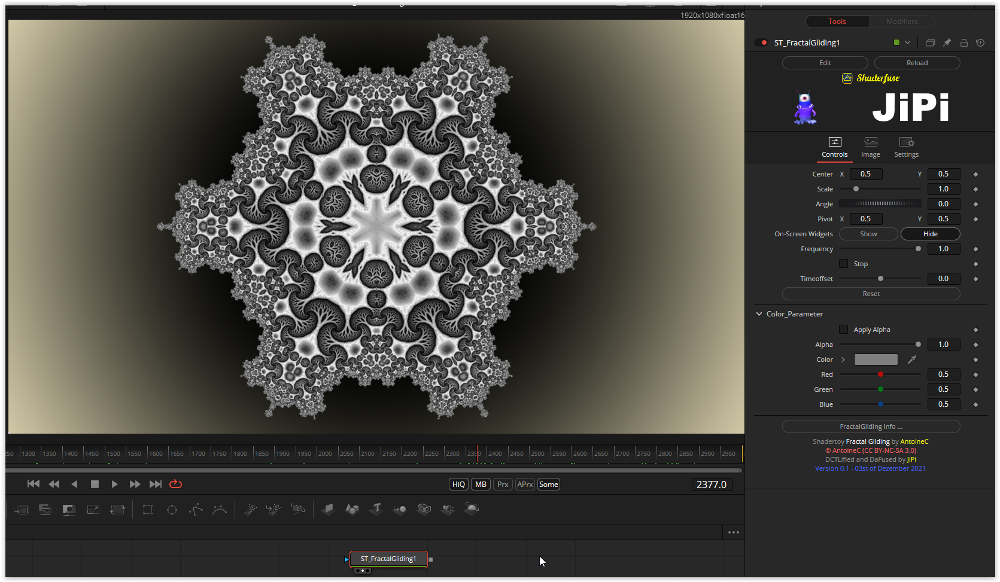

# FractalGliding

This Fuse is based on the Shadertoy '_[Fractal Gliding](https://www.shadertoy.com/view/ftGGDR)_' by [AntoineC](https://www.shadertoy.com/user/AntoineC). Conversion to DCTL and encapsulation into a fuse done by [JiPi](../../Site/Profiles/JiPi.md). See [ShaderOfTheWeek](README.md) for more fuses in this category.

<!-- +++ DO NOT REMOVE THIS COMMENT +++ DO NOT ADD OR EDIT ANY TEXT BEFORE THIS LINE +++ IT WOULD BE A REALLY BAD IDEA +++ -->

One of the most complex conversions I've done, there was again a lot to learn.
There are 9 float, 6 double float, 4 tripple float, one boolean and one integer, which were originally implemented as global variables. In the first attempt I tried the possibility of global variables in Cuda, unfortunately this led to picture interference (a known problem). So these variables were looped once across the entire program, sometimes as pointers. However, this led to the execution time increasing dramatically. You need a bit of patience, but then you get a great fractal film that is 133 seconds long, divided into an intro and seven scenes.

Have fun playing

<!-- +++ DO NOT REMOVE THIS COMMENT +++ DO NOT EDIT ANY TEXT THAT COMES AFTER THIS LINE +++ TRUST ME: JUST DON'T DO IT +++ -->

## Compatibility

🟥 macOS / Metal 
⬛ macOS / OpenCL: NOT TESTED! 
🟩 Windows / CUDA: checked 
🟩 Windows / OpenCL: checked 

## Problems

Number of problems: 3

- Thumbnail seems to be not a 320x180 pixel PNG
- macOS_Metal compatibility: 💣💣💣 *Fusion crashes*
- macOS_OpenCL compatibility not checked

