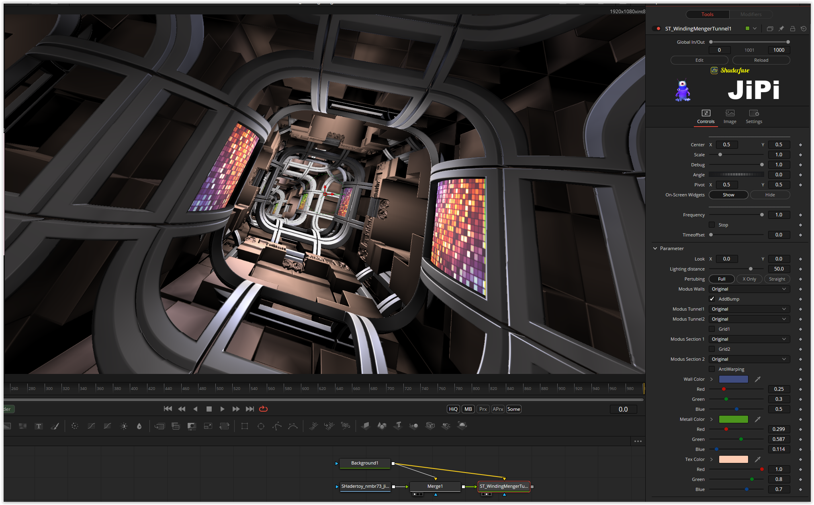

<!-- +++ DO NOT REMOVE THIS COMMENT +++ DO NOT ADD OR EDIT ANY TEXT BEFORE THIS LINE +++ IT WOULD BE A REALLY BAD IDEA +++ -->

I had already tried a Menger shader with no success. This time no error has crept in and no incompatibilities have occurred.
The individual objects are controlled by a global variable (objID). In order for the shader to work under OpenCL, this variable must go through all functions. This has now been implemented in version 2 of the fuse. Extensive parameters have also been added. Different tunnel modes can now be set. In addition to the original version, the two sections now have three variants and the metal grid of the sections can be switched on and off. A texture for the bump map has also been added. This allows indentations to be created in the open spaces of the tunnel.
In the original, the tunnel is "bent" in both X and Y directions. This can now be set using the pertubing parameter.

Here I came across a Mat3 addition for the first time and the range of functions had to be expanded:

```
__DEVICE__ inline mat3 mat3_add_mat3 (mat3 A, mat3 B) {
   mat3 C;

   C.r0 = to_float3 (A.r0.x + B.r0.x, A.r0.y + B.r0.y, A.r0.z + B.r0.z);
   C.r1 = to_float3 (A.r1.x + B.r1.x, A.r1.y + B.r1.y, A.r1.z + B.r1.z);
   C.r2 = to_float3 (A.r2.x + B.r2.x, A.r2.y + B.r2.y, A.r2.z + B.r2.z);

   return C;
   }
```

[](WindingMengerTunnel.fuse)

Have fun playing

<!-- +++ DO NOT REMOVE THIS COMMENT +++ DO NOT EDIT ANY TEXT THAT COMES AFTER THIS LINE +++ TRUST ME: JUST DON'T DO IT +++ -->

